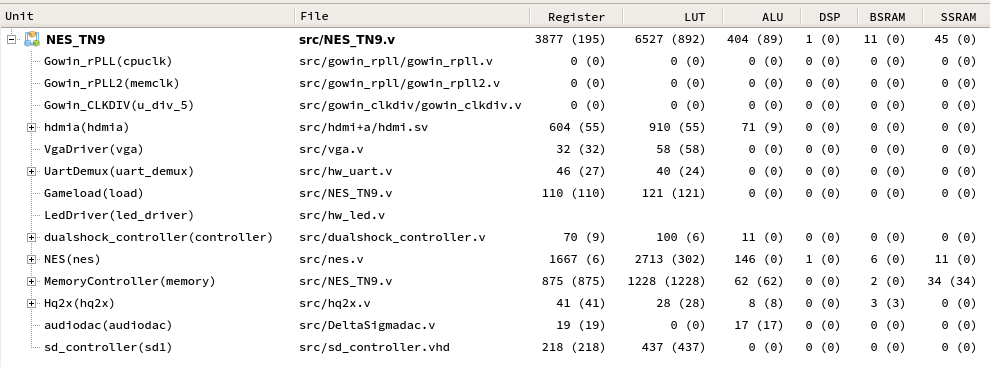

# Nestang in Tang Nano 9k

[Tang Nano 9k](https://github.com/hi631/tang-nano-9K) NES core written in System Verilog with [nestang](https://github.com/nand2mario/nestang) Dual Shock 2 Interface.

Implemented for a [Tang Nano 9k](https://wiki.sipeed.com/hardware/en/tang/Tang-Nano-9K/Nano-9K.html) taking ~6.5k LUTs, and can be modified to have **bluetooth gamepads** by using [blueretro](https://github.com/darthcloud/BlueRetro) Project, if you want to do so, check out [docs](docs/) folder.

## Bluetooth Support

This part is optional, you will need an ESP32 with a [Dualshock 2 blueretro](https://github.com/darthcloud/BlueRetro) firmware.

Check out the Project [Constraint File](../src/NES_TN9.cst), but if you won't build from source or do any modifications you can make this wiring:

| Tang Nano 9k | ESP32 | Dualshock 2 Interface |
|:---:|:---:|:---:|
|25|D33|CLOCK|
|26|D32|COMMAND|
|27|D19|DATA|
|28|D34|ATTENTION|

*I personally recommend adding some terminating resistors (from 50 to 120 ohms) in these wires to avoid reflections.

## ROM Flashing

Just binary write the NES rom (in [iNES](https://www.nesdev.org/wiki/INES) format) into the microSD card in raw data.

If you flash using [dd](https://en.wikipedia.org/wiki/Dd_%28Unix%29) command in linux, make sure the entire binary will fit 512 bytes block by padding the remaining space with any data.

I recommend using a binary editor tool as [ImHex](https://github.com/WerWolv/ImHex) or make a script to do that job.

## Build from Source

You will need GoWin Official EDA, follow these steps:

1. open the project [gprj](../nestang9k-ps2.gprj) file
2. make the top entity to be `NES_TN9` module
3. select `System Verilog 2007` to be the project synthesizer
4. run Synthesize, then Place and Route tools
5. flash the `.fs` file
